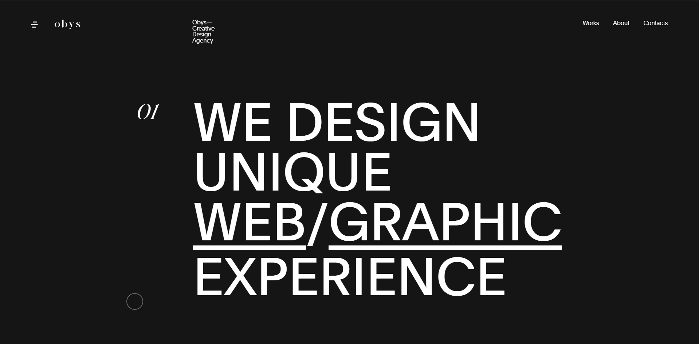
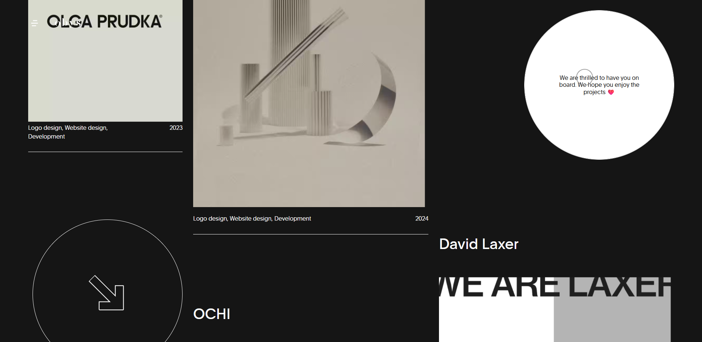
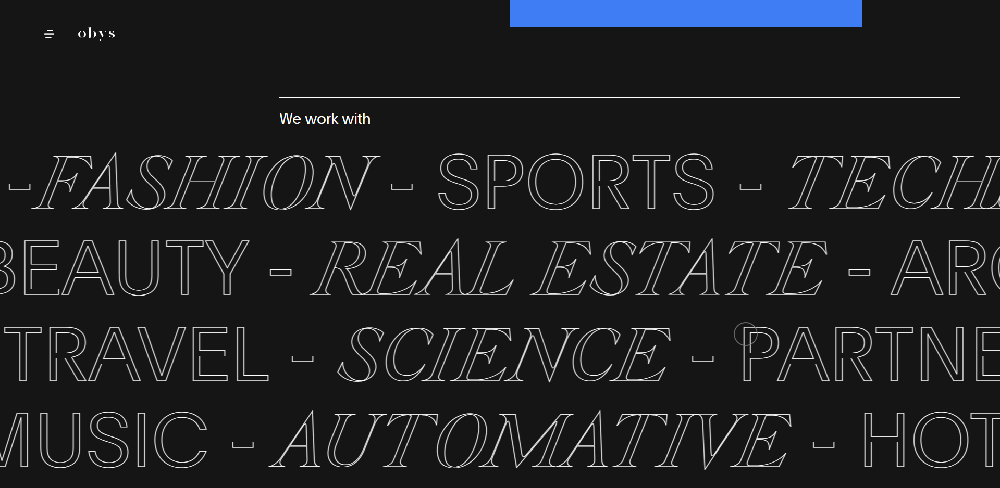

# Obys Agency Clone (Homepage Only)

A pixel-perfect, high-fidelity clone of the Obys Creative Agency homepage, developed with modern web technologies including HTML, CSS, JavaScript, and GSAP.  
This project replicates complex animations, smooth transitions, and an engaging user experience inspired by Obys’ creative style.

## 🚀 Live Demo
[Click here to view](https://obys-agency-vimal.vercel.app)

---

## 📸 Screenshots

### 🖼 Homepage

### 📦 Complex Section with Structured Boxes

### 🖼 Infinity Scroll Animation

---

## ✨ Features

- ⚡ Smooth scrolling with **Lenis**
- 🎬 Complex scroll-based animations using **GSAP** and **ScrollTrigger**
- 🖱️ Interactive hover and cursor effects with **Shery.js**
- 🧠 Creative layout and visual storytelling
- 💻 Responsive design for all screen sizes
- ⏳ Custom animated loader

---

## 🛠️ Tech Stack

- **HTML5**
- **CSS3**
- **JavaScript (ES6)**
- [`GSAP`](https://greensock.com/gsap/)
- [`ScrollTrigger`](https://greensock.com/scrolltrigger/)
- [`Shery.js`](https://github.com/sheryianscodingschool/sheryjs)
- [`Lenis`](https://github.com/darkroomengineering/lenis)

---

## 📈 Project Status & Roadmap

- ✅ **Homepage design and animations completed** using HTML, CSS, JavaScript, GSAP, and Shery.js  
- 🔄 Currently working with my existing frontend skills
- 🚧 **Planned upgrades as I learn new technologies:**
  - [ ] Add a **responsive navbar**
  - [ ] Implement **page transitions**
  - [ ] Build a full multi-page layout and complete site flow
  - [ ] Migrate to **React** and **Next.js**
  - [ ] Integrate **Framer Motion** for smoother and more advanced animations
  - [ ] Add optional **backend functionality** (e.g., contact form, CMS integration)

> ⚡ This is an evolving project — it will be continuously improved as I grow as a developer.

---

## 🤝 Credits & Inspiration

- Inspired by the design and creativity of [Obys Creative Agency](https://obys.agency)
- Developed with ❤️ by **Vimal Verma**

---

## 📜 License

This project is intended for **educational purposes only**.  
No commercial use is permitted.

> Feel free to explore and learn from the code, but please do not copy the project for commercial work or claim as your own.

